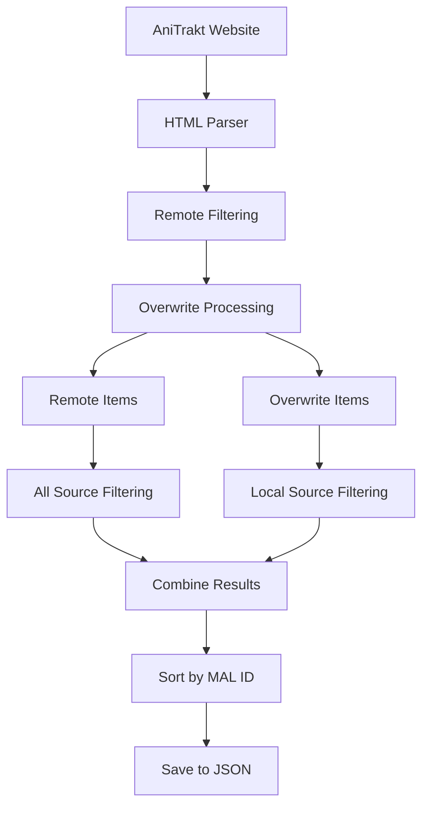

# db.trakt.anitrakt

[](https://github.com/rensetsu/db.trakt.anitrakt)
[](https://github.com/rensetsu/db.trakt.anitrakt/fork)

A scraped table data from [AniTrakt by Huere](https://anitrakt.huere.net/) to
get anime mappings on [MyAnimeList](https://myanimelist.net) and [Trakt](https://trakt.tv).

> [!WARNING]
>
> **THIS REPO IS NOT OFFICIALLY SUPPORTED BY HUERE, MAL, or TRAKT.**

If you used any contents from this repo in your project and found bugs or want
to submit a suggestion, please send us [issues](https://github.com/rensetsu/db.trakt.anitrakt/issues).

> [!NOTE]
>
> **Extended Database Available**
>
> For a more comprehensive dataset with richer metadata, please use
> the [Extended Database](https://github.com/rensetsu/db.trakt.extended-anitrakt)
> repo instead. The extended database includes release years, external IDs
> (TMDB, TVDB, IMDb), and handles issues like `guessed_slug`. This repository
> should primarily be used if you only need the basic mapping between MyAnimeList
> and Trakt IDs.

## Features

- **Intelligent Filtering**: Configurable ignore rules with support for AND/OR logic  
- **Data Overwriting**: Manual overrides for specific entries via overwrite files
- **Error Handling**: Robust error handling with custom exception hierarchy
- **Modular Architecture**: Clean, maintainable code structure with separated concerns

## Data Structure

| Key Name | Type | Description |
| --- | --- | --- |
| `title` | `string` | The title of the anime |
| `mal_id` | `int` | MyAnimeList ID of the anime |
| `trakt_id` | `int` | Trakt ID of the show/movie |
| `guessed_slug` | `string \| null` | Guessed slug of the anime, see [comments](#guessed-slug) for additional context |
| `type` | `Enum["shows", "movies"]` | Type of the anime |
| `season` | `int` | Season number of the anime, only for `type == "shows"` |

### Examples

> [!NOTE]
>
> Final result does not contain comments, it's just for additional context in
> this README.

#### Shows

```jsonc
[
  // Example of a show "Shingeki no Kyojin", both season 1 and 2
  {
    "title": "Shingeki no Kyojin",
    "mal_id": 16498,
    "trakt_id": 1420,
    "guessed_slug": "attack-on-titan",
    "type": "shows",
    "season": 1
  },
  {
    "title": "Shingeki no Kyojin Season 2",
    "mal_id": 25777,
    "trakt_id": 1420,
    "guessed_slug": "attack-on-titan",
    "type": "shows",
    "season": 2
  }
]
```

To construct a link, you can use the following format:

```text
https://trakt.tv/{type}/{guessed_slug}/seasons/{season}
```

#### Movies

```jsonc
[
  // Example of a movie "Kimi no Na wa."
  {
    "title": "Kimi no Na wa.",
    "mal_id": 32281,
    "trakt_id": 1402,
    // Guessed slug won't work for movies, see additional comment
    "guessed_slug": "your-name",
    "type": "movies"
  }
]
```

To construct a link, you can use the following format:

```text
https://trakt.tv/{type}/{guessed_slug}-{year, see additional comment}
```

## Configuration Files

### Ignore Rules (`db/ignore_movies.json` & `db/ignore_tv.json`)

The parser supports intelligent filtering through ignore rule files. These
rules allow you to exclude specific items from the final dataset based on
various criteria.

#### Structure

```jsonc
[
  {
    "source": "remote|local|all",
    "type": "OR|AND|ANY|ALL", 
    "conditions": [
      {
        "field_name": "value_to_match"
      }
    ],
    "description": "Human-readable description of the rule"
  }
]
```

#### Source Types

- **`remote`**: Applied to items from AniTrakt before overwrite merging
- **`local`**: Applied only to overwrite items (after merging)
- **`all`**: Applied to all remaining items after overwrite processing

#### Rule Types

- **`OR`/`ANY`**: Match if **any** condition is true
- **`AND`/`ALL`**: Match if **all** conditions are true

#### Supported Fields

You can create conditions based on any field in the data structure:

- `title` - Exact title match
- `mal_id` - MyAnimeList ID (supports `null` for missing IDs)
- `trakt_id` - Trakt ID (supports `null` for missing IDs)
- `guessed_slug` - Generated slug
- `season` - Season number (shows only)
- `type` - Media type ("movies" or "shows")

If multiple fields exists inside one condition statement, it will behave as
`AND`.

#### Example Ignore Rules

```jsonc
[
  {
    "source": "all",
    "type": "ANY",
    "conditions": [
      { "mal_id": 0 },
      { "mal_id": null },
      { "trakt_id": 0 },
      { "trakt_id": null }
    ],
    "description": "Ignore items with invalid IDs"
  },
  {
    "source": "remote", 
    "type": "ANY",
    "conditions": [
      { "mal_id": 50532 },
      { "mal_id": 986 },
      { "mal_id": 12231 },
      { "mal_id": 32051 },
      { "mal_id": 2020 },
      { "mal_id": 31704 },
      { "mal_id": 28285 }
    ],
    "description": "Special/OVA titles found in TV show entries"
  },
  {
    "source": "all",
    "type": "AND",
    "conditions": [
      { "type": "movies" },
      { "guessed_slug": null }
    ],
    "description": "Remove movies without valid slugs"
  }
]
```

### Overwrite Files (`db/overwrite_movies.json` & `db/overwrite_tv.json`)

These files contain manual additions or corrections to the scraped data. Items
in overwrite files take precedent and can only be filtered by `"source": "local"`
ignore rules. They are fully protected from "remote" and "all" source filtering.

#### Use Cases

- Add missing entries not found in AniTrakt database
- Correct incorrect mappings or metadata
- Override titles with better translations
- Add custom entries for special cases

#### Example Overwrite

```jsonc
[
  {
    "title": "Nijiyon Animation 2",
    "mal_id": 57623,
    "trakt_id": 198874,
    "guessed_slug": "nijiyon-animation", 
    "season": 2,
    "type": "shows"
  },
  {
    "title": "Ameku Takao no Suiri Karte",
    "mal_id": 58600,
    "trakt_id": 233930,
    "guessed_slug": "ameku-m-d-doctor-detective",
    "season": 1,
    "type": "shows"
  }
]
```

## Processing Pipeline

The parser follows this sequence to ensure data integrity and clear override precedent:

1. **Fetch & Parse**: Scrape data from AniTrakt website
2. **Remote Filtering**: Apply ignore rules with `"source": "remote"` to remote data
3. **Overwrite Processing**: Merge/replace items from overwrite files (takes precedent)
4. **Final Filtering**: Apply ignore rules with `"source": "all"` to remaining remote items
5. **Local Filtering**: Apply ignore rules with `"source": "local"` to overwrite items only
6. **Sorting & Output**: Merge results and save to JSON files sorted by MAL ID

### Data Flow Diagram



## Usage

### Prerequisites

```bash
pip install requests beautifulsoup4
```

### Running the Parser

```bash
python main.py
```

The parser will automatically:
- Fetch the latest data from AniTrakt
- Apply all configured filters and overwrites
- Generate sorted JSON output files
- Create a timestamp file for tracking updates

### Output Files

| File | Description |
|------|-------------|
| `db/movies.json` | Movie mappings (sorted alphabetically) |
| `db/tv.json` | TV show mappings (sorted alphabetically) |
| `updated.txt` | Last successful update timestamp (UTC) |
| `movies.html` | Cached HTML from AniTrakt movies page |
| `shows.html` | Cached HTML from AniTrakt shows page |

### Configuration Files (Optional)

| File | Purpose |
|------|---------|
| `db/ignore_movies.json` | Ignore rules for movies |
| `db/ignore_tv.json` | Ignore rules for TV shows |
| `db/overwrite_movies.json` | Manual overrides for movies |
| `db/overwrite_tv.json` | Manual overrides for TV shows |

## Architecture

The refactored codebase follows a modular architecture:

- **`FileManager`**: Handles all file I/O operations with UTF-8 support
- **`FilterEngine`**: Processes ignore rules with AND/OR logic
- **`DataManager`**: Manages data merging and overwriting
- **`HTMLParser`**: Scrapes and parses AniTrakt website data
- **`AniTraktParser`**: Main orchestrator coordinating all components
- **`TextUtils`**: Text processing utilities for slugification
- **Custom Exceptions**: Proper error handling hierarchy

## Guessed Slug

### Recommendation

For the most reliable and complete data, including accurate slugs, release
years, and other metadata, it is **highly recommended** to use the
**[Extended repo](https://github.com/rensetsu/db.trakt.extended-anitrakt)**.
The extended database programmatically fetches the correct information directly
from the Trakt.tv API, resolving the limitations described below.

This repository is best suited for users who only require the basic mapping
between MyAnimeList and Trakt IDs.

### `guessed_slug` Limitations

If you choose to use this repository, please be aware of the following
limitations regarding the `guessed_slug` field:

* **Based on English Titles**: \
  Slugs are generated from the presumed English title of the anime. This can
  lead to inaccuracies if the title on Trakt.tv differs.

* **Movies Require the Year**: \
  The `guessed_slug` for movies is incomplete. Trakt.tv requires the release
  year to be appended to the slug (e.g., `your-name-2016`). This information is
  not included in this database.

* **Potential for Mismatches**: \
  While generally effective for TV shows, a `guessed_slug` might not work for
  shows with similar names on Trakt as well.

* **Non-alphabetical Titles**: \
  Titles that are purely numerical or symbols have a `null` value for
  `guessed_slug` to prevent conflicts with Trakt's numeric ID system.

In cases where the `guessed_slug` is incorrect, you can always fall back to
using the `trakt_id` to fetch the correct information directly from the
Trakt.tv API.

## Contributing

We welcome contributions! Here's how to get started:

1. **Fork the repository**
2. **Create your feature branch**: `git checkout -b feature/amazing-feature`
3. **Configure ignore rules or overwrite files** as needed
4. **Test your changes**: `python main.py`
5. **Commit your changes**: `git commit -m 'Add amazing feature'`
6. **Push to the branch**: `git push origin feature/amazing-feature`
7. **Open a Pull Request**

### Contribution Guidelines

- Ensure all new features include appropriate logging
- Test ignore rules and overwrite files thoroughly
- Update documentation for any new configuration options
- Follow the existing code style and architecture patterns
